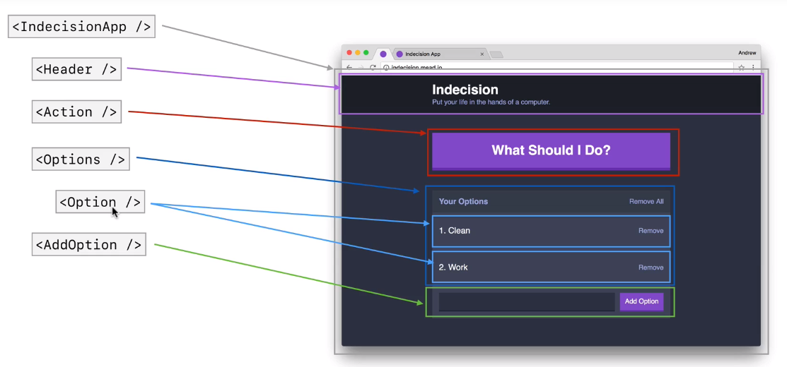

# Introduction

I am taking a react course to better my skills in React by completing actual projects. Course cost \$9.99 on a "New Years Sale".

Course started 01/11/2020.

<!---
Comments look like this and do not show up in the PDF
-->

References are cited as @mittner2014brain or [@mittner2014brain].

# Developing Tips

Turn on live-server in one terminal:

```sh
live-server public
```

Watch babel make changes in a second terminal:

```sh
babel src/app.js --out-file=public/scripts/app.js --presets=env,react --watch
```

# Video 20 - Picking an Option

[video link](https://www.udemy.com/course/react-2nd-edition/learn/lecture/7707656#content)

buttons can be disabled in HTML:

```html
<button disabled="true">Click me</button>
```

This will start with just a visibility toggle H1 element

```javascript
const render = () => {
  const jsx = (
    <div>
      <h1>Visibility Toggle</h1>
    </div>
  );
  ReactDOM.render(jsx, document.getElementById("app"));
};

render();
```

Ternary Operator. check visibility = true, if true button text says "hide details", if visibility = false the button text says "show details".

```javascript
{
  visibility ? "Hide details" : "Show details";
}
```

# Video 21 - Build It: Visibility Toggle

[video link](https://www.udemy.com/course/react-2nd-edition/learn/lecture/7707658?components=buy_button%2Cdiscount_expiration%2Cgift_this_course%2Cintroduction_asset%2Cpurchase%2Cdeal_badge%2Credeem_coupon#content)

Creating a visibility toggle application. It's basically just a button to show details will toggle text on / off.

Instead of the normal babel command, run the one below. It watches our visibility toggle app, and compiles it to app.js which the live server is watching:

```sh
babel src\playground\build-it-visible.js --out-file=public/scripts/app.js --presets=env,react --watch
```

# Video 22 - Section Intro: React Components

[video link](https://www.udemy.com/course/react-2nd-edition/learn/lecture/7707668#content)

# Video 23 - Thinking in React

[video link](https://www.udemy.com/course/react-2nd-edition/learn/lecture/7707672#content)




# Video 24 - ES6 Classes: Part I

[video link](https://www.udemy.com/course/react-2nd-edition/learn/lecture/7707674#content)

```sh
babel src/playground/es6-classes-1.js --out-file=public/scripts/app.js --presets=env,react --watch
```

Constructor function is the function that gets called when you make a new instance of a class. Constructors get called implicitly.
The below code would call the Person class and pass in the string 'Andrew Grube' and the number 30.

```javascript
const me = new Person("Andrew Grube", 30);
```

The below code is a class. The constructor function takes in 2 arguments and sets defaults for their variables.

```javascript
class Person {
  constructor(name = "Anonymous", age = 0) {
    this.name = name;
    this.age = age;
  }
}
```

# Video 25 - ES6 Classes: Part II

[video link](https://www.udemy.com/course/react-2nd-edition/learn/lecture/7707676?start=0#content)

Learning how to create subclasses using the ES6 class syntax.

Extends is a special keyword to say "we want the class 'student' to extend an existing class, which is 'person'"

We have to let the parent function do its thing before we do the extended class stuff. We do this by using the keyword "super". Super refers to the parent class. In this case the parent class of 'Student' is 'Person'. And if we call as a function it's the same as calling the parent constructor function.

```javascript
class Person {
  constructor(name = "Anonymous", age = 0) {
    this.name = name;
    this.age = age;
  }
  getGreeting() {
    // return 'Hi. I am ' + this.name + '!';
    return `Hi. I am ${this.name} and I am ${this.age} years old!`;
  }
  getDescription() {
    return `${this.name} is ${this.age} years old.`;
  }
}

class Student extends Person {
  constructor(name, age, major) {
    super(name, age);
    this.major = major;
  }
  hasMajor() {
    return !!this.major;
  }
  getDescription() {
    let description = super.getDescription();
    if (this.hasMajor()) {
      description += ` Their major is ${this.major}`; // description = description + ` Their major is ${this.major}`
    }
    return description;
  }
}
```

# Video 26 -

[video link]()

# Video 27 -

[video link]()

# Video 28 -

[video link]()

# Video 29 -

[video link]()

# Video 30 -

[video link]()

# Video 31 -

[video link]()
