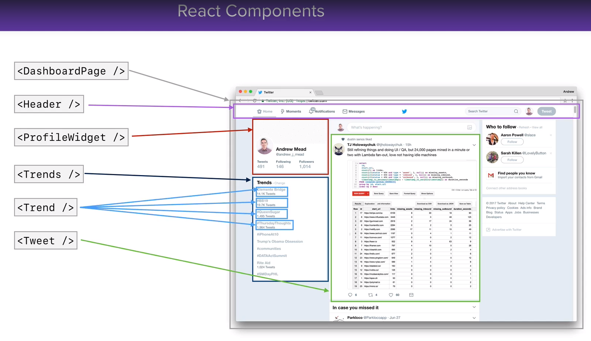
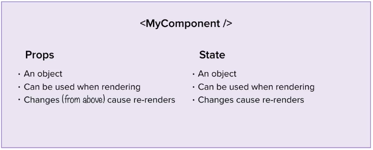
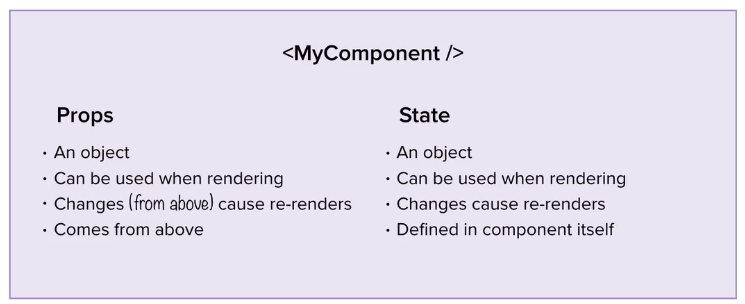
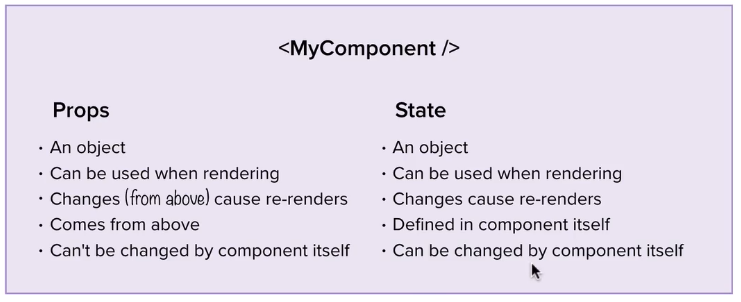
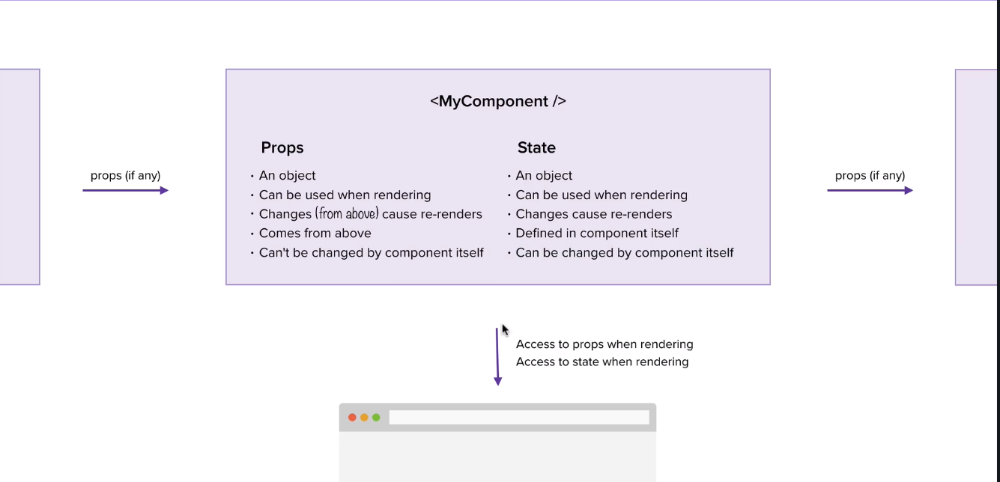

# Introduction

I am taking a react course to better my skills in React by completing actual projects. Course cost \$9.99 on a "New Years Sale".

Course started 01/11/2020.

<!---
References are cited as @mittner2014brain or [@mittner2014brain].
-->

# Developing Tips

Turn on live-server in one terminal:

```sh
live-server public
```

Watch babel make changes in a second terminal:

```sh
babel src/app.js --out-file=public/scripts/app.js --presets=env,react --watch
```

# Section 3: Hello React

## Video 20 - Picking an Option

[video link](https://www.udemy.com/course/react-2nd-edition/learn/lecture/7707656#content)

buttons can be disabled in HTML:

```html
<button disabled="true">Click me</button>
```

This will start with just a visibility toggle H1 element

```javascript
const render = () => {
  const jsx = (
    <div>
      <h1>Visibility Toggle</h1>
    </div>
  );
  ReactDOM.render(jsx, document.getElementById("app"));
};

render();
```

Ternary Operator. `check visibility = true`, if true button text says "hide details", if `visibility = false` the button text says "show details".

```javascript
{
  visibility ? "Hide details" : "Show details";
}
```

## Video 21 - Build It: Visibility Toggle

[video link](https://www.udemy.com/course/react-2nd-edition/learn/lecture/7707658?components=buy_button%2Cdiscount_expiration%2Cgift_this_course%2Cintroduction_asset%2Cpurchase%2Cdeal_badge%2Credeem_coupon#content)

Creating a visibility toggle application. It's basically just a button to show details will toggle text on / off.

Instead of the normal babel command, run the one below. It watches our visibility toggle app, and compiles it to app.js which the live server is watching:

```sh
babel src\playground\build-it-visible.js --out-file=public/scripts/app.js --presets=env,react --watch
```

# Section 4: Hello React

## Video 22 - Section Intro: React Components

[video link](https://www.udemy.com/course/react-2nd-edition/learn/lecture/7707668#content)

## Video 23 - Thinking in React

[video link](https://www.udemy.com/course/react-2nd-edition/learn/lecture/7707672#content)




## Video 24 - ES6 Classes: Part I

[video link](https://www.udemy.com/course/react-2nd-edition/learn/lecture/7707674#content)

```sh
babel src/playground/es6-classes-1.js --out-file=public/scripts/app.js --presets=env,react --watch
```

Constructor function is the function that gets called when you make a new instance of a class. Constructors get called implicitly.  
The below code would call the Person class and pass in the string 'Andrew Grube' and the number 30.

```javascript
const me = new Person("Andrew Grube", 30);
```

The below code is a class. The constructor function takes in 2 arguments and sets defaults for their variables.

```javascript
class Person {
  constructor(name = "Anonymous", age = 0) {
    this.name = name;
    this.age = age;
  }
}
```

## Video 25 - ES6 Classes: Part II

[video link](https://www.udemy.com/course/react-2nd-edition/learn/lecture/7707676?start=0#content)

Learning how to create subclasses using the ES6 class syntax.  
Extends is a special keyword to say "we want the class 'student' to extend an existing class, which is 'person'"  
We have to let the parent function do its thing before we do the extended class stuff. We do this by using the keyword "super". Super refers to the parent class. In this case the parent class of 'Student' is 'Person'. And if we call as a function it's the same as calling the parent constructor function.

```javascript
class Person {
  constructor(name = "Anonymous", age = 0) {
    this.name = name;
    this.age = age;
  }
  getGreeting() {
    // return 'Hi. I am ' + this.name + '!';
    return `Hi. I am ${this.name} and I am ${this.age} years old!`;
  }
  getDescription() {
    return `${this.name} is ${this.age} years old.`;
  }
}

class Student extends Person {
  constructor(name, age, major) {
    super(name, age);
    this.major = major;
  }
  hasMajor() {
    return !!this.major;
  }
  getDescription() {
    let description = super.getDescription();
    if (this.hasMajor()) {
      description += ` Their major is ${this.major}`; // description = description + ` Their major is ${this.major}`
    }
    return description;
  }
}
```

## Video 26 - Creating a React Component

[video link](https://www.udemy.com/course/react-2nd-edition/learn/lecture/7707678?start=0#content)

Your classes have to start with an upper case letter.

```javascript
class Header extends React.Component {
  render() {
    return (
      <div>
        <p>This is from header</p>
      </div>
    );
  }
}

const jsx = (
  <div>
    <h1>Title</h1>
    <Header />
  </div>
);

ReactDOM.render(jsx, document.getElementById("app"));
```

## Video 27 - Nesting Components

[video link](https://www.udemy.com/course/react-2nd-edition/learn/lecture/7707680?start=0#content)

Components can render JSX.
Component can render other components.

```javascript
class IndecisionApp extends React.Component {
  render() {
    return (
      <div>
        <Options />
      </div>
    );
  }
}
class Options extends React.Component {
  render() {
    return (
      <div>
        <p>Options component here</p>
        <Option />
      </div>
    );
  }
}

class Option extends React.Component {
  render() {
    return (
      <div>
        <p>Option component here</p>
      </div>
    );
  }
}
ReactDOM.render(<IndecisionApp />, document.getElementById("app"));
```

The above code renders IndecisionApp. IndecisionApp renders a component call Options. Options renders an Option component.

## Video 28 - Component Prompts

[video link](https://www.udemy.com/course/react-2nd-edition/learn/lecture/7707682?start=0#content)

Passing data in when we initialize our components, that data is known as "props". Props is short for properties.

When we create instances of react components, we can also choose to pass some data into it. That data looks very much like HTML attributes, but it's really just a set of key value pairs where the key is some sort of string and the value is anything we like (string, array, number, etc.). When we pass data into a component, we can use that data inside of the component itself. In this case we passed in a title and subtitle, and we used that information to correctly render header.

```javascript
class IndecisionApp extends React.Component {
  render() {
    const title = "Indecision";
    const subtitle = "Put your life in the hands of a computer.";
    return (
      <div>
        <Header title={title} subtitle={subtitle} />
      </div>
    );
  }
}

class Header extends React.Component {
  render() {
    return (
      <div>
        <h1>{this.props.title}</h1>
        <h2>{this.props.subtitle}</h2>
      </div>
    );
  }
}
```

All of your props are available on `{this.props}`. This gives us a way to set up one-way communication.  
For example, <IndecisionApp /> can communicate some information with: `<Header/>`, `<Action />`, `<Options />`, and `<AddOption />`.  
`<Options />` can communication also communicate some information with `<Option />`.  
At the bottom, we can pass some props in : `ReactDOM.render(<IndecisionApp />, document.getElementById("app"));`

## Video 29 - Events & Methods

[video link](https://www.udemy.com/course/react-2nd-edition/learn/lecture/7707684?start=0#content)

We still used our jsx event attributes `onSubmit` and `onClick`.

```javascript
class AddOption extends React.Component {
  handleAddOption(e) {
    e.preventDefault();
    const option = e.target.elements.option.value;
    if (option) {
      alert(option.trim());
    }
  }
  render() {
    return (
      <div>
        <form onSubmit={this.handleAddOption}> <!-- Referenced Line of Code -->
          <input type="text" name="option"></input>
          <button>Add</button>
        </form>
      </div>
    );
  }
}
```

We still referenced a function we want to call. Instead of referencing a global function at the top of the file, we are referencing a class method. A class method is contained inside of the class. That means that `<AddOption />` has everything it needs to run. It has the HTML that is eventually going to render, the event handler, and the event method. The method is defined in the `handleAddOption()`.

We did that for `handleAddOption()`, `handleRemoveAll()`, and `handlePick()` in the `<Action />` component:

```javascript
class Action extends React.Component {
  // handlePick is only accessable by this component as its scope
  // is contained to this component.
  handlePick() {
    alert("handlePick");
  }
  render() {
    return (
      <div>
        <button onClick={this.handlePick}>What Should I Do?</button>
      </div>
    );
  }
}
```

## Video 30 - Method Binding

[video link](https://www.udemy.com/course/react-2nd-edition/learn/lecture/7707686?start=0#content)

Options class has `handleRemoveAll()` and `render()`.

If you do something like this, and then clicking on the "Remove all" button we will get an error "Cannot read property of 'props' of undefined.

```javascript
class Options extends React.Component {
  handleRemoveAll() {
    console.log(this.props.options);
    // alert("some message");
  }
  render() {
    return (
      <div>
        <button onClick={this.handleRemoveAll}>Remove All</button>
        {this.props.options.map(option => (
          <Option key={option} optionText={option} />
        ))}
      </div>
    );
  }
}
```

It looks like we lose our binding to the Options class.

The great thing about bind and why it's useful is that you can use the first argument to set the "this" context. So this means we can set it equal to that 'obj' object bring the context back to what we would expect.

```javascript
const obj = {
  name: "Vikram",
  getName() {
    return this.name;
  }
};

const getName = obj.getName.bind(obj);

console.log(getName());
```

You can also set variables in line:

```javascript
const getName = obj.getName.bind({ name: "Andrew" });
```

More reading: [Deep dive on the bind() function](https://developer.mozilla.org/en-US/docs/Web/JavaScript/Reference/Global_objects/Function/bind)

```javascript
class Options extends React.Component {
  constructor(props) {
    super(props);
    this.handleRemoveAll = this.handleRemoveAll.bind(this);
  }
}
```

Whenever we call `handleRemoveCall()` the context is correct. Which means if we use `handleRemoveCall()` multiple times below, we won't have to type multiple `.bind()` calls inline.  
It also means that we just run the binding once when the component first gets initialized. It doesn't need to get rebound each time the component rerenders.

## Video 31 - What is Component State?

[video link](https://www.udemy.com/course/react-2nd-edition/learn/lecture/7707688#overview)

[Medium Article React State vs Props](https://codeburst.io/react-state-vs-props-explained-51beebd73b21)
[Official React Docs](https://reactjs.org/docs/faq-state.html)
[States and Props in React](https://scotch.io/courses/5-essential-react-concepts-to-know-before-learning-redux/what-is-props-and-state-in-react)

Component state allows our component to manage some data. Think about an object, with various key:value pairs. When that data changes, the component will automatically rerender to reflect those changes.  
We did this in the jsx version of the indecision app where we had to call `render();` at the end of every function.

```javascript
const onRemoveAll = () => {
  app.options = [];
  render();
};
```

With component state all we have to do is manipulate the data and the component will take care of rerendering itself.

## Video 32 - Adding State to Counter App: Part I

[video link](https://www.udemy.com/course/react-2nd-edition/learn/lecture/7707692#overview)

```sh
babel src/playground/counter-example.js --out-file=public/scripts/app.js --presets=env,react --watch
```

```javascript
class Counter extends React.Component {
  constructor(props) {
    super(props);
    this.handleAddOne = this.handleAddOne.bind(this);
    this.handleMinusOne = this.handleMinusOne.bind(this);
    this.handleReset = this.handleReset.bind(this);
  }
  handleAddOne() {
    console.log("handleAddOne");
  }
  handleMinusOne() {
    console.log("handleMinusOne");
  }
  handleReset() {
    console.log("handleReset");
  }
  render() {
    return (
      <div>
        <h1>Count: </h1>
        <button onClick={this.handleAddOne}>+1</button>
        <button onClick={this.handleMinusOne}>-1</button>
        <button onClick={this.handleReset}>reset</button>
      </div>
    );
  }
}

ReactDOM.render(<Counter />, document.getElementById("app"));
```

## Video 33 - Adding State to Counter App: Part II

[video link](https://www.udemy.com/course/react-2nd-edition/learn/lecture/7707694#overview)

`this.setState` allows us to manipulate a state object, then the component will refresh automatically.

```javascript
class Counter extends React.Component {
  constructor(props) {
    super(props);
    this.handleAddOne = this.handleAddOne.bind(this);
    this.handleMinusOne = this.handleMinusOne.bind(this);
    this.handleReset = this.handleReset.bind(this);
    this.state = {
      count: 0
    };
  }
  handleAddOne() {
    this.setState((prevState) => {
      return {
        count: prevState.count + 1
      };
    });
  }
```

The variable that is passed in to the `this.setState()` is the previous state of the variables. You don't necessarily have to call it 'prevState'.
In the above code the `handleAddOne()`is set up differently than in the counter-example.js code which is shown below:

```javascript
handleAddOne() {
    this.setState(prevState => {
      return {
        count: prevState.count + 1
      };
    });
  }
```

VSCode extension prettier is taking away the parenthesis around prevState variable.

## Video 34 - Alternative setState Syntax

[video link](https://www.udemy.com/course/react-2nd-edition/learn/lecture/7707696#overview)

## Video 35 - Build It: Adding State to VisibilityToggle

[video link](https://www.udemy.com/course/react-2nd-edition/learn/lecture/7707698#overview)

## Video 36 - Indecision State: Part I

[video link](https://www.udemy.com/course/react-2nd-edition/learn/lecture/7707700#overview)

## Video 37 - Indecision State: Part II

[video link](https://www.udemy.com/course/react-2nd-edition/learn/lecture/7707702?start=15#overview)

JavaScript Demo: Array.concat():

```javacript
const array1 = ['a', 'b', 'c'];
const array2 = ['d', 'e', 'f'];
const array3 = array1.concat(array2);

console.log(array3);
// expected output: Array ["a", "b", "c", "d", "e", "f"]

```

[Additional reading on concat()](https://developer.mozilla.org/en-US/docs/Web/JavaScript/Reference/Global_Objects/Array/concat)

## Video 38 - Summary: Props vs. State

[video link](https://www.udemy.com/course/react-2nd-edition/learn/lecture/7707704#overview)

- `this.props` and `this.state` is an object in our components.
- If some data gets passed into my component from the parent I can access that when we're rendering. If a component manages some state, it can use that state when it's rendering itself. We saw that with the `addOption` component which renders the error message that it keeps track of.
- We have access to props when rendering, and we have access to state when rendering.
- For state, the component itself can change the data. It does this with a `this.setState()` call.
- A component can not change its own props. If the props are going to change, it's because they're going to get passed down from the parent.



- Props come from above (whether it's a parent component, or some JSX that gets passed into `ReactDOM.render()`)
- State is defined in the component itself.



- Props can not be changed by the component itself. If some string was passed into a component and I rendered that, I wouldn't be able to change `this.props.somedata` in order to see it re-render. That's not going to work. If you do want to track changing data you have to use state.
- State can be changed by the component itself.





# Section 5: Stateless Functional Components

## Video 39 - Sectional Intro

[video link](https://www.udemy.com/course/react-2nd-edition/learn/lecture/7707706#overview)

## Video 40 - The Stateless Functional Component

[video link](https://www.udemy.com/course/react-2nd-edition/learn/lecture/7707708#overview)

- Stateless Functional Component
- It is a react component, just like our class based components.
- It is also just a function, unlike our class based components.
- It is stateless.

```javascript
const User = () => {
  return (
    <div>
      <p>Name: </p>
      <p>Age: </p>
    </div>
  );
};

ReactDOM.render(<User />, document.getElementById("app"));
```

We can pass in props by passing the values into the arrow function:

```javascript
const User = props => {
  return (
    <div>
      <p>Name: {props.name}</p>
      <p>Age: {props.age}</p>
    </div>
  );
};

ReactDOM.render(
  <User name="Andrew" age={30} />,
  document.getElementById("app")
);
```

## Video 41 - Default Prop Values

[video link](https://www.udemy.com/course/react-2nd-edition/learn/lecture/7707712#overview)

You can pass in values when rendering your application:

```javascript
ReactDOM.render(
  <IndecisionApp options={["McDonalds", "Chipotle"]} />,
  document.getElementById("app")
);
```

## Video 42 - React Dev Tools

[video link](https://www.udemy.com/course/react-2nd-edition/learn/lecture/7707714#overview)

## Video 43 - Removing Individual Options

[video link](https://www.udemy.com/course/react-2nd-edition/learn/lecture/7707716#overview)

- Implicitly return an object by wrapping the return value for the function body in `()`

```javascript
  handleDeleteOptions() {
    this.setState(() => ({ options: [] }));
  }
```

[Learn about the filter function](https://developer.mozilla.org/en-US/docs/Web/JavaScript/Reference/Global_Objects/Array/filter)

```javascript
const words = [
  "spray",
  "limit",
  "elite",
  "exuberant",
  "destruction",
  "present"
];

const result = words.filter(word => word.length > 6);

console.log(result);
// expected output: Array ["exuberant", "destruction", "present"]
```

# Section 6: Webpack

# Section 7: Using a Third-Party Component

# Section 8: Styling React

# Section 9: React-Router

# Section 10: Redux

# Section 11: React with Redux

# Section 12: Testing Your Application

# Section 13: Deploying Your Apps

# Section 14: Firebase 101

# Section 15: Firebase with Redux

# Section 16: Firebase Authentication

# Section 17: Styling Budget App

# Section 18: What Now?

# Section 19: Hooks, Context, Fragments, and More
